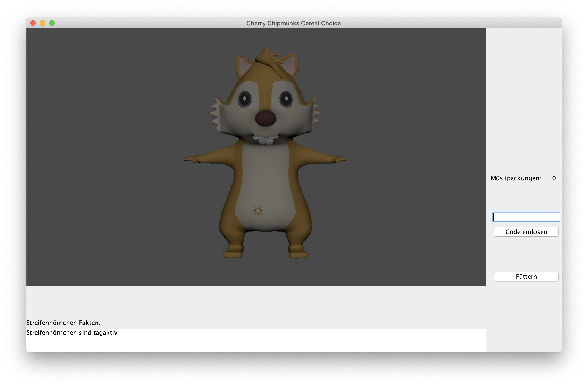

# Software_Engineering_CCCC

**Belegarbeit im Fach Software Engineering II, SoSe 2020**

#### Teilnehmer Gruppe (Nr. 2):

* Lionel Burg
* Dominic Berge
* Jannik Schmied

#### Anwenderdokumentation

* Fakten: 
    * Alle fünf Sekunden wird ein neuer Fakt angezeigt
    * Alle zehn Sekunden ist ein neuer Fakt verfügbar
* Code einlösen
    * Mittels des Textfeldes kann ein neu erworbener Code eingegeben werden
    * Durch Linksklick auf den Button "Einlösen" wird der Code geprüft und bei erfolgreicher Prüfung eingelöst, es erscheint eine Erfolgsmeldung.
    * Im Fehlerfall wird eine Fehlermeldung ausgegeben
* Füttern
    * Durch Linksklick auf den Button "Füttern", wird das Streifenhörnchen gefüttert
    * In Abhängigkeit des Hungergrades werden drei verschiedene Zustände visuell dargestellt:
        * hungrig
        * neutral
        * fröhlich
* Speichern und Beenden
    * Der aktuelle Spielstand wird automatisch beim Beenden in eine .dat Datei gespeichert.
    * Beim Spielstart wird aus der gleichen Datei der aktuelle Stand geladen 
